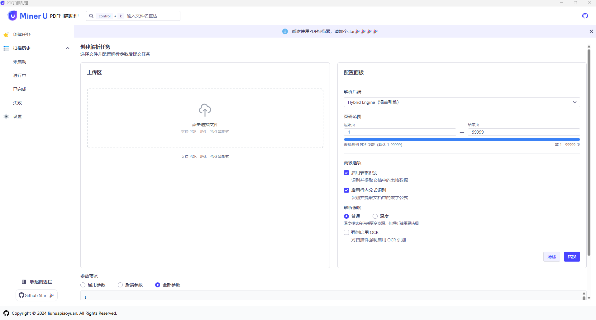
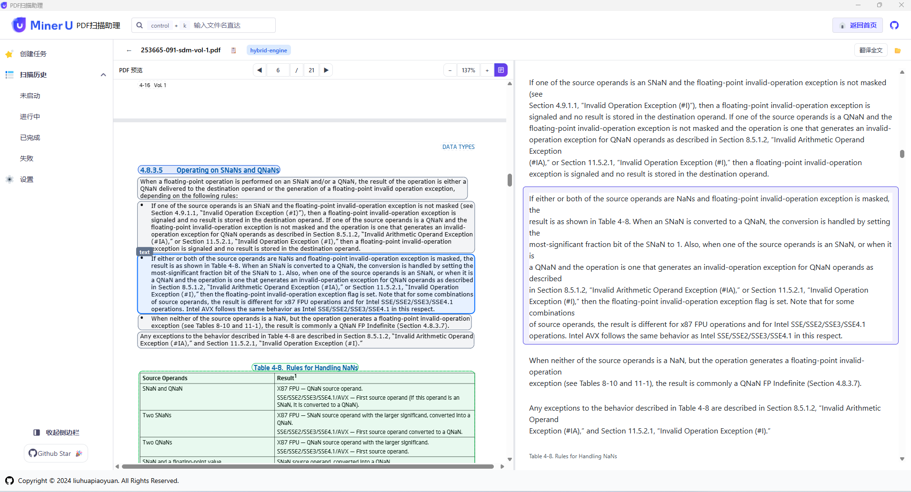
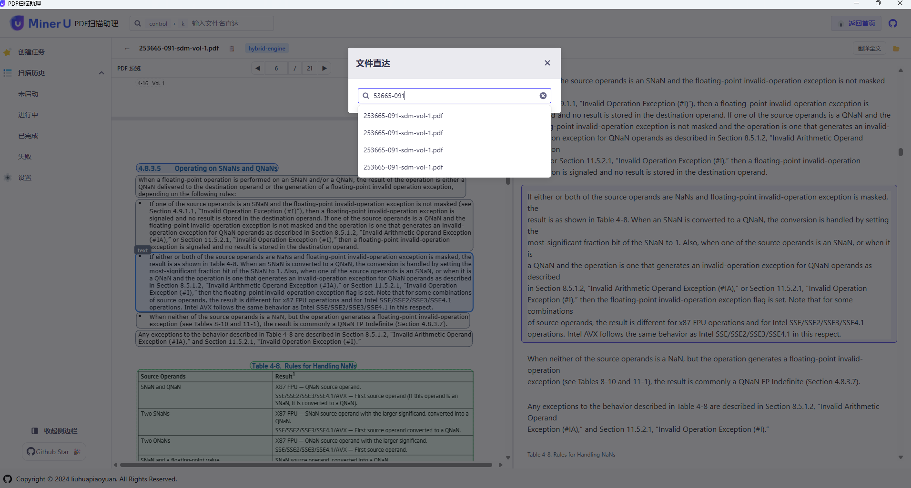

# MinerU-PDFScanner

> 本项目基于 [liuhuapiaoyuan/MinerU-PDFScanner](https://github.com/liuhuapiaoyuan/MinerU-PDFScanner) 进行了**大量重构**，代码结构与 UI 交互均有显著改进，并新增了 AI 翻译等实用功能。

MinerU-PDFScanner 是一款基于 [MinerU](https://github.com/opendatalab/MinerU) 的 Windows 客户端程序，用于高效地扫描和提取 PDF 文档中的内容。该工具结合深度学习技术，能够自动提取文档中的文字、表格、图片和公式等，并提供多种分析和统计功能。

## 功能

1. **创建提取任务**
   - 用户可以选择 PDF 文件并提交提取任务。

2. **AI 翻译** ✨
   - 支持调用 AI 接口对提取结果进行翻译，方便跨语言阅读和文档国际化处理。

3. **提取记录查看**
   - 支持按照不同状态查看提取记录，便于管理和跟踪任务进度。

4. **导出提取结果**
   - 用户可以将提取后的结果导出为 ZIP 文件，方便存储和分享。

5. **查看提取结果**
   - 提供左右分栏模式查看提取结果，左侧为 PDF 文档，右侧为 Markdown 格式的提取结果。

6. **打包导出**
   - 通过 zip 导出提取结果，包含 Images。

## 安装

1. 从 [发行页面](https://github.com/liuhuapiaoyuan/MinerU-PDFScanner/releases/latest) 下载最新的安装包。
2. 双击安装包并按照提示完成安装。

## 使用方法

**重点**: 要配套 [https://github.com/liuhuapiaoyuan/MinerU-webui](https://github.com/liuhuapiaoyuan/MinerU-webui) 作为后端API

1. 启动 MinerU-PDFScanner。
2. 点击"创建任务"，选择要提取的 PDF 文件。
3. 提交任务后，可以在"提取记录"中查看任务状态。
4. 提取完成后，可以导出结果或在右侧查看提取内容。
5. PDF 查看左右两侧分栏同步查看

## 图片展示

## 技术支持

如有问题或建议，请在 [Issues 页面](https://github.com/liuhuapiaoyuan/MinerU-PDFScanner/issues) 提出。

## 贡献

欢迎贡献代码！请阅读 [贡献指南](CONTRIBUTING.md) 以了解更多信息。

## License

本项目遵循 MIT 许可证，详细信息请见 [LICENSE](LICENSE) 文件。
